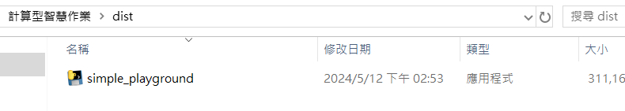
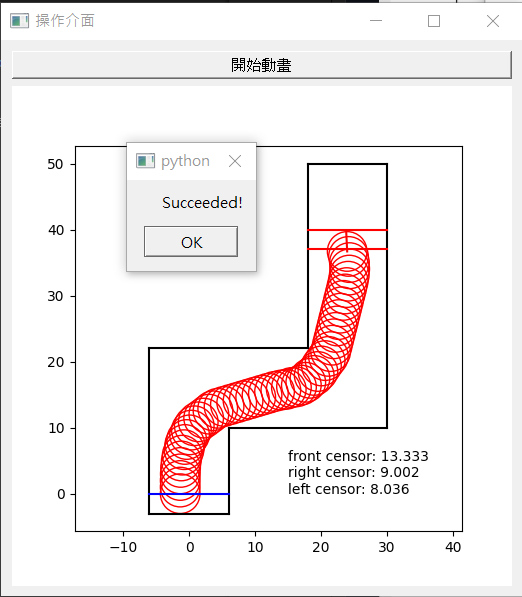
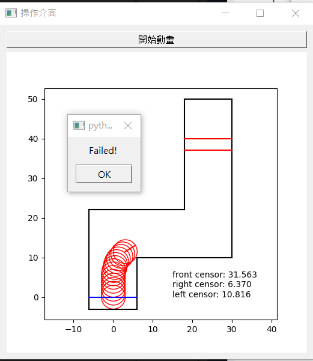

# 操作方法

開啟`executable file`中的`simple_playground.exe`

執行之後，出現下圖

點擊開始動畫後，就會自動訓練完畢後進行動畫

 

以下是成功畫面

 

以下是失敗畫面

# 模糊系統

1. 模糊化機構：方形歸屬函數
2. 模糊推論引擎：max-min合成
3. 模糊規則庫：函數式模糊規則
4. 去模糊化機構：無（因為這次採用函數式模糊規則同時前鑒部又都沒什麼模糊的部分，所以不需要去模糊化的部分）

# 採用規則

## 模糊規則

1. **if** 中間探測器偵測的距離越短 **then** $y = \frac{40}{1+1.6\exp(x-16)}$ (此處的y代表的是車子的方向盤角度) 
(以下的代表的y是自走車方向盤角度乘上的值)
2. **if** 右探測器距離比左探測器距離大 **then** $y = 1$
3.  **if** 右探測器距離比左探測器距離小 **then** $y = -1$
4.  **if** 右探測器距離比左探測器距離差不多 **then** $y = 0$  

## 模糊函數

方向盤轉向判斷： 
（x是右探測器和左探測器的差） 
向左：$\mu_{A_1}(x) = \begin{cases}1,\quad x \le -3.5 \\
                              0,\quad -3.5 \lt x 
                 \end{cases}$ 

向右：$\mu_{A_2}(x) = \begin{cases}1,\quad 3.5 \le x \\
                              0,\quad x \lt 3.5
                 \end{cases}$

不變：$\mu_{A_3}(x) = \begin{cases}1,\quad -3.5 \le x \le 3.5 \\
                              0,\quad else
                 \end{cases}$

## 注意事項

> [!NOTE]可精進之處
> 1. 這次的模糊函數其實寫得沒有到很像真的模糊函數，反而更像單純的判斷函數，但是成功率卻意外地很高
> 2. 其他可以改進的部分不外乎就是把模糊函數中的歸屬函數修改的細緻一點
> 

